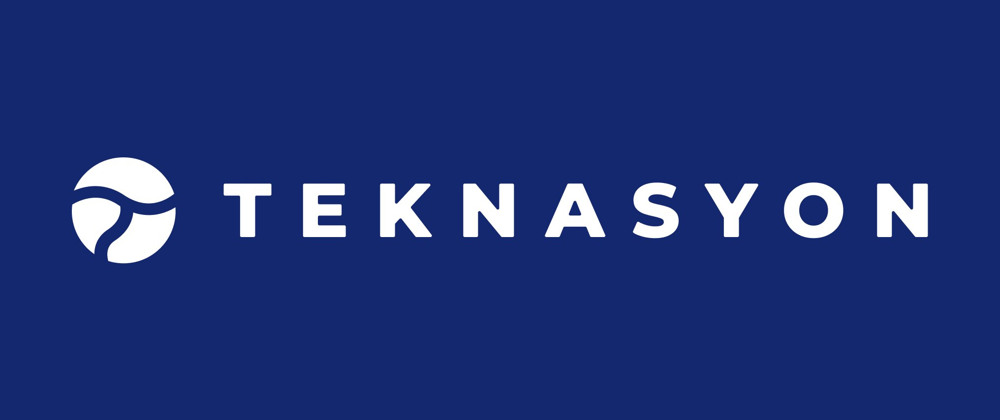

<h1 align="center"> Elixir Bootcamp 2023 Sonbahar (Online) </h1>  

  

## İçindekiler

- [Bootcamp Hakkında](#bootcamp-hakkında)
- [Başvuru Kılavuzu](#başvuru-kılavuzu)
  - [Başvuru Şartları](#başvuru-şartları)
  - [Başvuru Yöntemi ve Süresi](#başvuru-yöntemi-ve-süresi)
- [Seçim Süreci](#seçim-süreci)
- [Eğitim Programı ve Süresi](#eğitim-programı-ve-süresi)
- [Eğitmenler ve İletişim](#eğitmenler-ve-iletişim)
- [Sponsor](#sponsors)

## Bootcamp Hakkında

Elixir: Eşzamanlı, yüksek hata toleransına sahip Erlang VM üzerine inşa edilmiş fonksiyonel
ve dinamik bir programlama dilidir. Elixir Türkiye Topluluğu tarafından gerçekleştirilen
2023 Sonbahar dönemi bootcamp'i, Türkçe konuşan programcılar arasında Elixir'i, fonksiyonel
programlamayı ve topluluğa katılımı yaygınlaştırmayı hedefler.

Elixir Bootcamp'i geçmişte hangi dili yazmış olursanız olun, yazılım geliştirmede ufkunuzu açacağı ve teknik tecrübenizi
arttıracağını garanti eder. Bunun yanında Elixir/Erlang ikisili,  Stackoverflow 2023 Survey verisine göre developerlar arasında
en çok sevilen ve dünya ortalamasında en çok kazandıran(103.000 Dolar) 2. programla dilidir. Aynı araştırmanın
verilerine göre ilk 7 dilin 6'sı fonksiyonel programlama dilleridir. [Referans](https://survey.stackoverflow.co/2022#technology-top-paying-technologies)

## Başvuru Kılavuzu

### Başvuru Şartları

* Katılımcıların en az 6 aylık bir programlama geçmişi olması beklenir. Başvurular
  arasında en yüksek tecrübeden en düşük tecrübeye doğru sıralama yapılacaktır. Elixir ve fonksiyonel programlama
  yazılıma yeni başlayanlar için uygun olmamakla birlikte istenilen verimin elde edilebilmesi için tecrübe şartı gerekli görülmüştür.

* Derslere katılım zorunludur. 2 hafta üst üste mazeretsiz katılmama, bootcampten elenmenize sebep olacaktır.

**Yukarı da belirtilen şartlar dışında herhangi bir başvuru şartı mevcut değildir.**

## Başvuru Yöntemi ve Süresi

Başvuru için formu eksiksiz doldurarak göndermeniz gerekmektedir [Başvuru Linki](https://forms.gle/7o1VY15JwqtTEmmZ9)

* Başvuru süresi 17 Temmuz - 20 Ağustos arası geçerlidir. 20 Ağustos 00:00 da form gönderme işlemi kapatılacaktır.

## Seçim Süreci

* Başvuruların kapanmasına müteakip(20 Ağustos), seçim süreci başlar. 1 Eylül itibari ile
  seçim süreci sonlanır ve seçilen katılımcılara mail ile bilgilendirme yapılır.
* Kontenjan 15 kişi ile sınırlıdır.

## Eğitim Programı ve Süresi

### Eğitim Programı

* İşletim Sistemlerine Giriş
  * İşletim Sistemi Processleri
  * Threads
  * Scheduling algorithms
  * Green threads ve OS modes
* Fonksiyonel Programlamaya Giriş
* Elixir’e giriş
* Basic types ve Modüller
* Collections ve Enum
* Pattern Matching ve Functions
* Mix ve Documentions
* Error Handling
* Elixir ve Erlang
* Concurrency
* Release ve Build
* OTP(Open Telecom Platform)
  * OTP concurrency
  * Genserver
  * Supervisors
  * Distribution
* Data Processing
  - Genstage
* Meta programming
* Specification ve Types
* Behaviors ve Protocols
* DB and Storage
  - Ecto
  - Erlang Term Storage
  - Agents
  - Mnesia
* Testing

### Süresi

Eğitim Programı 10 Eylül - 20 Kasım arasında 8 hafta olarak planlanmıştır. Bitiş tarihi esneklik gösterebilir.
Eğitim haftasonları(cumartesi ve pazar) 1 saat 30 dk, akşam 18:00 - 19:30 arası olacaktır.

## Eğitmenler ve İletişim

Eğitmen: Doğukan Zorlu - Senior Software Developer at Teknasyon

İletişim: info@elixirturkiye.org, dogukanzrlu@gmail.com, [Twitter](https://twitter.com/DogukannZorlu)

## Sponsors

